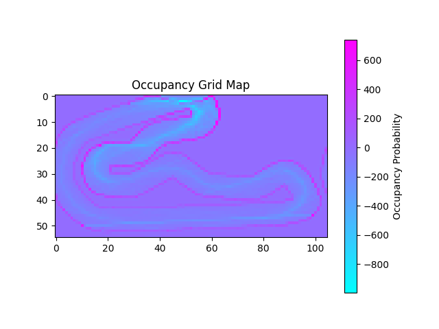

# Free Path Bot

## Overview
This project started with the goal of training an unsupervised Proximal Policy Optimization network to drive a car around a 2D track with only 3 distance sensors at 0 degrees (forward), 45 degrees, and -45 degrees. For anyone who knows anything about neural networks, you probably could have told me that this was a tremendous waste of time, but I'm glad nontheless that I wasted that time myself!

The project has now transformed into a 2D racing game built in pygame where you can plug in any one of 3 available Agents (PPO, FCN, and SillyGoose) to make realtime gas, brake, and steering decisions based on the current game state. I'm in the process of folding in lidar and occupancy grid mapping to improve the decision making and reward function. There's also a joystick class for driving the car with the arrow keys, the map class which can accept any of the .jpg image names in the /images directory, and a checkpoint class that allows for drawing checkpoints, which is still in the works!

## Results
Before I get too far into the technicals of this project, let's start with the visuals! Starting first with of course, the illest of the chillest screenshots; the OGM results. There were a few tracks that I used, and for each track, you'll see the raw OGM grid, the edge detections highlighted in red, and the safe area, each explained in greater detail below.

<!--  -->
<p>
  
  
  
</p>
Daytona: A simple oval track. Nothing too complex, there's a horizontal overflow in the plot that I **should** fix....
<p>
  
  
  
</p>
Labrynth: A sufficiently complex environment to test OGM and other heuristic driving / obstacle avoidance algorithms.
<p>
  
  
  
</p>
Tsukuba: A track from Gran Turismo 7, shout out to my GT7 players, what whaaaaat! Something worth noting, this track accentuates the possible need for dynamic edge padding to avoid "choking out" the safe driving area in narrower sections of track.

## Instructions

### Install
1. Clone the repository
```
git clone https://github.com/NicholasStine/free-path-bot.git
```
2. cd into the cloned repo
3. Install all packages. *You may also consider moving to a virtual environment like anaconda before proceeding.*
```
pip install --user tensorflow pygame numpy
```
4. run the game!
```
python main.py
```
5. deal with the almost certain flow of "package not found" errors :)
6. keep trying till it works..?
7. throw your keyboard and / or computer into a lake

## Neural Networks
### Fully Connected Network (FCN)
Of the two AI attempts, the Fully Connected Network using a standard genetic training algorithm produced the most reliable driving behavior. In the first few generations of training on an oval track, this bad boy was able to drive around the track so well that I had to double check that I didn't accidentally leave the heuristic driving rules uncommented! Too bad after around 4-5 generations (with a population of 25), this car quickly converged into flooring it at full speed, and turning hard to the left (directly into a wall hehehe).

### Proximal Policy Optimization (PPO)
My first attempt at AI was to train a PPO network to infer real time driving from the state. This made sense given that my original focus was on a driving agent that could be plopped down into any environment and drive like a speed demon right out of the box! Since policies are more geared towards a generalized response to state and stimuli, I was hoping that this network architecture could avoid overfitting to the tracks on which it was trained to drive, but would instead associate common track features with driving decisions (i.e. a policy!).

Let's be real though, while this was a great chance to learn about stochastic decision making, and a whole bunch of insane math that I honestly can't remember a month later, I failed to get this to work. PPO is (at this time) a bit out of my reach. The shit is hard, ok!? No matter though, the FCN approach has great potential, and I can always fall back on the SillyGoose algorithm hahaha!

### The Silly Goose Algorithm
As with any scientific approach to a problem, it's wise to eliminate unwanted variables. I already had a working 2D car game with a joystick class for driving the car around manually. But after maybe a week of trying to get the PPO working, I needed to verify that, given the rudimentary laser scanner with 3 lasers (at 0, -45, and 45 degrees), a bot could actually drive around the track. In comes the heuristic ruleset! If left close, go right, if right close go left, if front far go like hell! Easy. But what do I call this masterpeice of simplicity? This monument to mediocrity? I call it a SillyGoose. deal with it.

This silly little goose drives great! I tested it on a variety of tracks (found in /images) and it makes (mostly) rational driving decisions! There was one edge case with penninsulas, or outcroppings in the track border, where if it had equal clearings on both left and right, it would drive strait into a boundary outcropping. I fixed this somewhat sloppily by choosing a random direction and sticking with it, (i think that *random* direction may actually be hard-coded, but I won't tell if you don't).

## Environment Mapping
### Scanner
The OG, the original, the hizza, the rizza, the start of it all. The laser scanner. It had three lasers in fixed orientations of -45, 0, and 45 degrees that cast strait out until they hit a track boundary. This was split into laser.py and scanner.py so I didn't have to deal with multiple lasers in the car.py class, but it worked out event better when I switched to lidar! Before that though, I updated the scanner check distances at -60 to 60 degrees at 15 degree increments, but it was all hard coded and really cumbersome. In comes the lidar!

### Lidar
This is honestly pseudo-lidar at best, **if** you can even call it that. Real lidar is cool as a muuhfuqa. There's a stack of lasers pointing at incremental angles along the x,z plane, and x (or y, idk lol) is rotated around z, and snapshots at even augular increments are collected to build a 3D representation of the environment that accounts for positional, elevational, and angular drift, and it uses the rotational timing to determine theta, which it has to account for in relation to the car moving, since it may be at one x,y position at theta 0 deg, and another x,y by the time it reaches say 90 or 180 degrees!f That shit is seriously so cool I can't event.

My "lidar" is not that, and please, don't worry about my ego as a dev; I'm laughing **very** hard while writing this. My lidar is a fixed list of lasers in increments of 12 degrees, which all simultaneously provide an instantaneous snapshot of the distances to all nearby track edges. No calculating theta, no accounting for movement as theta changes, just a clean, easy snapshot. Yes I know this is totally idealized. Yes I know this is basically cheating in terms of robotics. This is the part where I say "but something snappy", *but* I'm not going to. I hope to soon revisit this and explain how future me added in **real** lidar to kick past me's a.s.s. *ps, still laughing MWUHAHAHAHAHA*

### Occupancy Grid Mapping
So this is cool! One of the great mysteries of my childhood was how a roomba can map it's way around a room using lasers? I think I read in a popular science edition that they make a map with these laser scans to decide where and how to best vacuum the room. I was prompthing Grok for "how can I use my existing laser scanner and 2D car simulation to 'map' the track" when I stumbled upon two very fascinating pieces of tech. Firstly to catch my eye was OGM. You could use some weird logarithmic magic to build a down sampled grid like representation of where the car can drive and where it can't. Super cool! 

I also upgraded from a fixed laser scanner on the front of the car to a pseudo-lidar implementation with lasers at fixed increments of 3 degrees (more resolution would be better but my laptop is S&%T so what'cha gonna do?). This gives me a really cool grayscale representation of the environment, and with a little scipy and numpy magic, I managed to use dilation and erosion to denoise and delineate the track, boundaries, and occupied space. I can then draw them in white, red, and black respectively, to produce a plot where the track and edges are color coded and clearly visible. 

I can also subtrack the edges from the track, to produce a black and white image where the white pixels are a safe-driving zone, and everythine else (including the dilated area around the borders) is shown as black for occupied. Que interesante!

## TODO
module for pickling observations
 - mainly for not having to run the game and drive around every time I'm working on OGM or other env mapping ops
 - this should be the only place that I check for cli args regarding clearing pickled data
 - could support different schemas?


Go back to genetic FCN with lidar data?
 - start with hard-coded number of inputs? 30 laser inputs (360÷12), plus velocity and theta and all that.
 - maybe I init the lidar and network together so I can dynamically set number of lidar input nodes.
 - I should also be saving the w&b's ot avoid having to train the network every time


Let's go back to rendering multiple agents at once
 - can I make it compatible with the current observation schema
 - if so, this would be used as a post-processor to generate a more useful visual of learning progress & agent behavior.
 - this is also eye candy! :) most youtube AI content creators produce content that looks like this, since watching one agent at a time would be kind of boring.. oh and not helpful.. but mostly boring.


I should move the different plotting configs 
 - track and borders, safe area, anything ellsssseeeee...?
 - should I have a wrapper function that defaults to probably track and borders


draw the OGM in pygame, not pyplot
 - it needs reworking to run in real time (i.e. to run in the game loop)
 - can I have different CLI args for different plot configs? 
   - I don't think I'd have to use args since cli args are in the global scope
 - I may run into issues with the grid overflowing along the width axis


can I add in a PID?
 - I would want to update the simulation to make driving more realistic, with...
   - momentum
   - drifting?
   - better modeling of turn radius (r) as a function:
     - r = f(v,b)
     - v: velocity (continuous, float)
     - b: braking (binary)
 - it would only be useful when using path finding algos (or ai?) to find a way around the track
 - it would live in the car I think? I believe that's where most telemetry data lives, so it would fit right in


path finding to replace neural networks
 - A* probably?
 - I would use it on the safe area plot
 - would this be used durring or after environment exploration?


can I use a CNN on the OGM grid representation learn to drive?
 - just like heuristic path finding, would I use this during or after exploration?
 - the outputs would be exactly the same as the other agents, hands and feet (steering and gas/brake)
 - instead of directly taking in the laser distance inputs, it would take in a downsampled gridlike representation of free and occupied space.
 - I really don't think this is a practical approach, it's more for the fun of it! I want to have plenty of options in the agents dropdown(s).

starting points! starting points, starting points!! starting points!!!!
 - I want a sandbox environment to select starting positions.
 - positions would include pos and theta
 - saves a pickled list of positions for use in the main game loop
 - would this live in the car?
 - the UX/UI would work as follows:
   1. start the sandbox environment and init and empty position list
   2. move the mouse to a desired starting position
   3. click and hold to set the position
   4. drag the cursor up or down to set the theta
   5. release the mouse to add position and theta to the position list
   6. check for x button press, if found: jump to step 8
   7. repeat from step 2
   8. pickle the position list
   9. quit pygame


can I go back to the checkpoints module?
 - what if I were to set checkpoints on the OGM grid, and not the map itself?
 - I would like to work this into a web based UX/UI with:
   - checkpoints mode!!
	    my original inspiration for the mobile UX/UI is so that if and when I switch to a physical bot, 
        I can use my phone to select desired checkpoints after the car has done some exploration. That
        way it has a defined path to follow and it's not just driving around at random.
   - exploration mode
     - the car drives around on it's own, probably with a heuristic model
     - an OGM and the car's position are displayed and updated in real time
     - this OGM should automatically scale to the current size of the explored env
   - training mode
     - I display the training on the web page :) 
     - generation and population dropdowns for the training loop
     - a pre-trained model selection dropdown for choosing a starting w&b file (should load options from saved files..? or database?)
     - an agent selection dropdown, with options for FCN and PPO
     - a data selection dropdown for OGM, lidar, or scanner
     - a display style dropdown for OGM, real-time, or full map
   - driving mode
     - a single agent does it's darndest to drive around the track
     - every time that bad boy crashes, a new one starts, and the loop repeats!
     - an agent selection dropdown, with options for 
       - FCN
       - PPO
       - SillyGoose
       - A*
     - display select dropdown for ogm, rt, fm MOVE TO ALWAYS
     - display current score?
     - reward function!! I need to start tracking changes to my reward functions 
       so I can go back and forth between different attempts without rewrites
